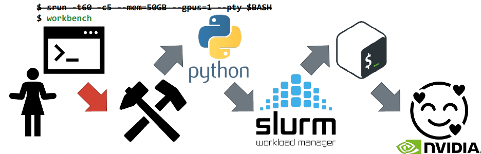

Workbench
=========

Approved for Public Release; Distribution Unlimited. 
Public Release Case Number 22-0668. <br>
&copy; 2024 The MITRE Corporation. ALL RIGHTS RESERVED.

This files used in this repository cna be deployed as an Ansible role to installs the correct files for `workbench` on HPC clusters running [Slurm](https://slurm.schedmd.com/overview.html).

`workbench` is a simple wrapper script that supports quick and easy GPU job deployments on HPC Clusters.

Why Workbench
-------------
Users need to be able to ...
* ... launch a single large simulation :white_check_mark: 
* ... launch hundreds of simulaions :white_check_mark: 
* ... submit jobs and walk away :white_check_mark: 

They also need...
* ... to debug :white_check_mark: 
* ... to launch interactive workloads :white_check_mark: 
* ... resources *now* :white_check_mark: 
* ... to not learn too many new things :x:

Slurm is a great resource for all points but the last one.  New users to Slurm that haven't worked on traditional HPC clusters aren't looking to learn the complicated Slurm syntax to launch jobs interactively.

Interactive Jobs in Slurm
-------------------------

The `srun` command can submit a job that runs right away:
```bash
$ srun hostname
gpu1.cl.cluster.local
```

It can also launch in an interactive terminal:
```bash
$ srun --pty $BASH
[user@gpu1 ~]$
```

Additional Slurm options can be added to meet user's needs:
```bash
$ srun -t60 -c5 --mem=50GB --gpus=1 --pty $BASH
[user@gpu1 ~]$
```

Why does this Fail?
-------------------

The above is what people want... but not really - new users (any users really) don't want to memorize all that syntax for something they'll run frequently.
* Too many options
* Too long
* Often users don't even know what this is looking for
* Error prone with *so much* typing

Why does workbench succeed?
---------------------------

`workbench` works because users need to not learn too many new things.  Workbench is simply a wrapper script for Slurm interactive jobs that saves users from keeping too much in their personal memory or notes.

What is workbench?
------------------

```bash
$ srun -t60 -c5 --mem=50GB --gpus=1 --pty $BASH
[user@gpu1 ~]$
```

`workbench` is two scripts that essentially runs the above command but with a few more options.  Overall, `workbench` is made up of about 250 lines of code and uses a Python script and a shell script to launch jobs. 



```bash
[user@login01 ~]$ workbench

Please wait for your allocation to be created. You have requested:
        -GPUs: 1
        -CPUs: 5
        -Memory: 50GB
        -Time: 4 Hours

Estimated Start Time: 2024-04-25T15:39:04
If the job takes longer than 1-2 minutes to start, check cspan.mitre.org and
squeue for resource availability. If utilization is at capacity, the
interactive option may be unavailable.

 __          __        _    _                     _
 \ \        / /       | |  | |                   | |
  \ \  /\  / /__  _ __| | _| |__   ___ _ __   ___| |__
   \ \/  \/ / _ \| '__| |/ / '_ \ / _ \ '_ \ / __| '_ \
    \  /\  / (_) | |  |   <| |_) |  __/ | | | (__| | | |
     \/  \/ \___/|_|  |_|\_\_.__/ \___|_| |_|\___|_| |_|


*****
Welcome to the WORKBENCH!
Your job is running on gpunode5
You have 1 GPU(s) reserved:
GPU 0: Tesla V100-SXM2-32GB (UUID: GPU-e0c399a2-2a6f-e687-b704-b0906db8fb71)
*****
Type 'exit' to leave the workbench.
Present Working Directory: /home/user

[user@gpunode5 ~]$ hostname
gpunode5
```

Features
--------
* `--help` lets people see the most important options
  * number of GPUs
  * GPU type
  * number of CPUs
  * Memory
  * Time
* Other Slurm options are fully supported
* Jupyter Notebook with port forwarding instructions
* Launch a singularity container
* Show VS Code port forwarding instructions

```bash
[user@login01 ~]$ workbench --help
usage: workbench [-h] [-g {0,1,2,3,4}] [-k {k80,m40,p100,v100,a100,a40}]
                 [-c CPU_COUNT] [-t WALLCLOCK] [-m MEMORY] [-p PARTITION]
                 [-A ACCOUNT] [--vs_debug] [--jupyter]
                 [--jupyter_args JUPYTER_ARGS] [--container CONTAINER_NAME]
                 [--bind BIND]

Launch an interactive job via Slurm on the HPC cluster. In addition to the
commands listed, any sbatch arguments will also work on the command line.
Workbench will only launch jobs on a single node. For more information on
sbatch commands: https://slurm.schedmd.com/sbatch.html

optional arguments:
  -h, --help            show this help message and exit
  -g {0,1,2,3,4}, --gpus {0,1,2,3,4}
                        Number of GPUs requested.
  -k {k80,m40,p100,v100,a100,a40}, --kind {k80,m40,p100,v100,a100,a40}
                        Type of GPU, use scontrol show nodes to review which
                        gpu types are available.
  -c CPU_COUNT, --cpus CPU_COUNT
                        Number of CPUs.
  -t WALLCLOCK, --time WALLCLOCK
                        Expected reservation duration in hours.
  -m MEMORY, --mem MEMORY
                        Expected memory required for the job.
  -p PARTITION, --partition PARTITION
                        Partition to run the job on.
  -A ACCOUNT, --account ACCOUNT
                        Associated project for accounting.
  --vs_debug            Launch an interactive VS Code Debug Session.
  --jupyter             Launch a Jupyter Notebook instance.
  --jupyter_args JUPYTER_ARGS
                        Additional arguments for Jupyter. Provide in quotes.
                        Do NOT include port or --no-browser.
  --container CONTAINER_NAME
                        Launch a specific singularity container. Provide the
                        .simg file name.
  --bind BIND           Input for singularity bind command.
```

Requirements
------------

Slurm, Python, and Bash must be already configured on the local system.

Role Variables
--------------

N/A

Dependencies
------------

N/A

Example Playbook
----------------
```yaml
- hosts: my_hosts
  gather_facts: true
  roles:
    - workbench
```

License
-------

GNU General Public License

Author Information
------------------

Christine Harvey, ceharvey@mitre.org
